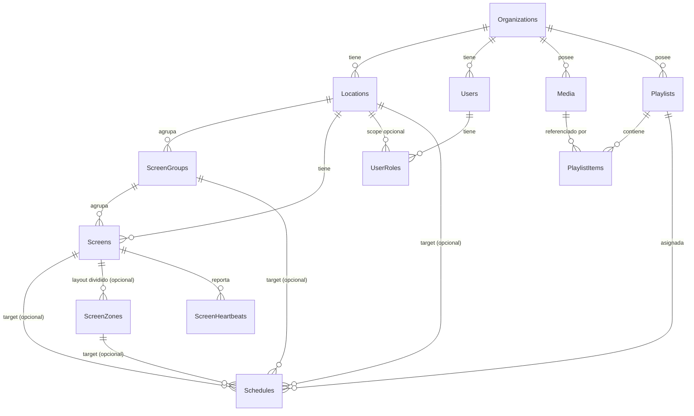

# Esquema de base de datos — Cartelería Digital

Motor: **SQL Server** (servidor propio existente). Script DDL en [`db/schema.sql`](../db/schema.sql).

## Diagrama entidad-relación

## Entidades

### Organizations / Locations
Modelo multi-tenant: cada **franquicia** es una `Organization`, y cada **restaurante** es una `Location` dentro de ella. Todo lo demás (usuarios, media, pantallas, playlists) cuelga directa o indirectamente de una organización, lo que permite aislar datos entre franquicias.

`Location.TimeZone` es clave: la programación horaria (`Schedules`) se evalúa en la zona horaria del restaurante, no en UTC del servidor.

### Users / Roles / UserRoles
Un usuario pertenece a **una única** `Organization`, salvo los usuarios `SuperAdmin`, cuyo `OrganizationId` es `NULL` (acceso global a todas las franquicias). Sus roles se guardan en `UserRoles`, donde `LocationId` puede ser `NULL` (rol aplicado a toda la franquicia, ej. `OrgAdmin`) o apuntar a un restaurante concreto (ej. `LocationAdmin` solo del restaurante X). Roles semilla: `SuperAdmin`, `OrgAdmin`, `LocationAdmin`, `Viewer`.

### ScreenGroups / Screens
Un restaurante puede agrupar pantallas (`ScreenGroups`, ej. "Sala", "Barra", "Terraza") para asignar programación a varias pantallas a la vez sin repetirla una a una.

**Emparejamiento de pantallas** (tipo Chromecast, sin login manual en el dispositivo):
1. Se crea el registro `Screen` desde el panel admin → se genera `PairingCode` (6 dígitos) con expiración corta.
2. El dispositivo muestra ese código en pantalla y lo introduce el admin, o al revés: el player pide un código al backend y el admin lo introduce en el panel para vincular.
3. Al emparejar, el backend emite un token de larga duración (`AuthTokenHash` almacena su hash) que el player guarda localmente y usa en cada polling.

`PollingIntervalSeconds` es configurable por pantalla (por si alguna necesita refrescar más o menos frecuentemente).

### ScreenZones (layout multi-zona)
Una pantalla puede dividirse en varias regiones independientes (`ScreenZones`): cada zona tiene su posición y tamaño en **porcentaje** (`X`, `Y`, `Width`, `Height`, 0-100) relativo a la propia pantalla, y un `ZIndex` para el orden de apilado si dos zonas se superponen. Una pantalla **sin** zonas se comporta exactamente igual que antes de que existiera esta tabla (una única `Schedule` a pantalla completa vía `ScreenId`).

### Media
Cada foto/video sube a **Azure Blob Storage**; la tabla solo guarda referencia (`BlobContainer` + `BlobPath`) y metadata (tamaño, duración de video, dimensiones). Las URLs reales se firman con **SAS tokens** al momento de servir al player, nunca se guardan URLs permanentes.

### Playlists / PlaylistItems
Una `Playlist` puede ser:
- **Específica de un restaurante** (`LocationId` con valor).
- **Plantilla a nivel de franquicia** (`LocationId = NULL`), reutilizable en varios restaurantes.

`PlaylistItems` define el orden (`SortOrder`) y duración de cada pieza; para video se usa la duración real del archivo, para imagen se usa `DurationSecondsOverride` o el default de la playlist.

### Schedules (programación)
Un `Schedule` asigna una `Playlist` a **exactamente uno** de: una pantalla concreta, un grupo de pantallas, todas las pantallas de un restaurante, o una zona concreta de una pantalla (`CK_Schedules_OneTarget` exige exactamente uno de `ScreenId`/`ScreenGroupId`/`LocationId`/`ScreenZoneId`). Define:
- Rango de fechas (`StartDate`/`EndDate`, este último `NULL` = indefinido).
- Días de la semana como bitmask (`DaysOfWeek`).
- Franja horaria (`StartTime`/`EndTime`).
- `Priority`: si dos schedules solapan para la misma pantalla en el mismo momento, gana el de mayor prioridad (ej. una promo puntual con prioridad alta sobre la playlist general).

El backend resuelve en tiempo real, en cada polling, cuál es el `Schedule` activo para esa pantalla dada la hora actual en la timezone de su `Location`.

### ScreenHeartbeats
Cada polling del player deja un registro (o se actualiza un agregado) con IP, versión y playlist activa — usado para el panel de monitorización de la fase 5 (pantallas online/offline, qué están reproduciendo ahora).

### AuditLogs
El borrado es **físico** (`DELETE` real) en todas las tablas de negocio, no hay flags `IsActive`. Antes de borrar, el backend guarda un snapshot JSON del registro en `AuditLogs` (qué se borró, quién, cuándo), dentro de la misma transacción que el `DELETE`. Esto cubre el requisito de "borrado físico con registro" sin arrastrar filas muertas en las tablas operativas.

Cuando se borra `Media` también hay que borrar el blob en Azure Storage (o moverlo a un contenedor de "papelera" antes de purgarlo) — responsabilidad del servicio de backend, no de la base de datos.

## Decisiones de diseño

- **PKs `UNIQUEIDENTIFIER` (GUID)**: evita IDs secuenciales adivinables en las URLs de la API y facilita generar IDs desde el backend antes de insertar (útil para Blob Storage paths, tokens de pairing, etc.).
- **Borrado físico + `AuditLogs`**: sin columnas `IsActive`; cada borrado deja un snapshot JSON auditable.
- **Un usuario, una organización** (excepto `SuperAdmin`, que no pertenece a ninguna y ve todas).
- **Playlists reutilizables a nivel organización** (`LocationId NULL`) para franquicias que quieren una campaña/promo idéntica en todos los restaurantes.
- Sin campos de idioma/moneda por `Location`: el sistema es puramente un player de foto/video, no gestiona menús ni precios.

## ORM

Se usará **Prisma** (TypeScript) sobre SQL Server:
- Tipado end-to-end generado automáticamente a partir de `schema.prisma`, coherente con Express + TS.
- Migraciones versionadas (`prisma migrate`) — más cómodo de mantener en equipo que TypeORM para este caso.
- Soporte estable de SQL Server como datasource.

El siguiente paso (scaffolding del backend) traducirá este `db/schema.sql` a `prisma/schema.prisma` como fuente de verdad para migraciones; `db/schema.sql` queda como documento de referencia/diseño.
